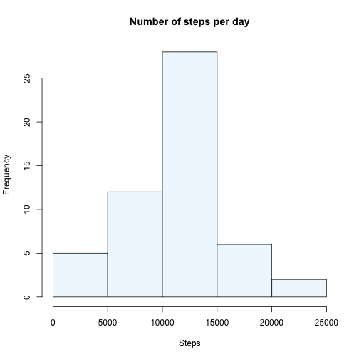
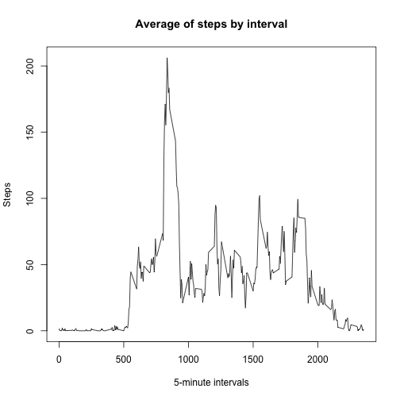
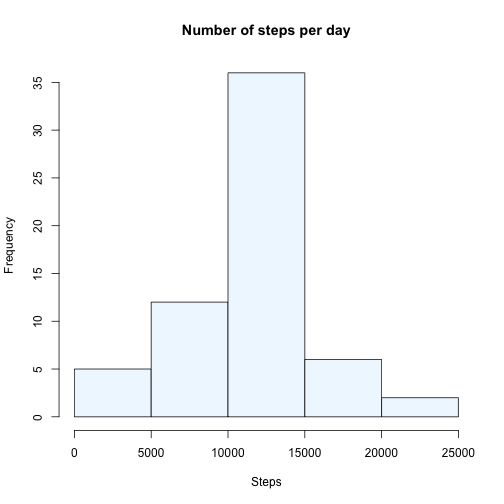
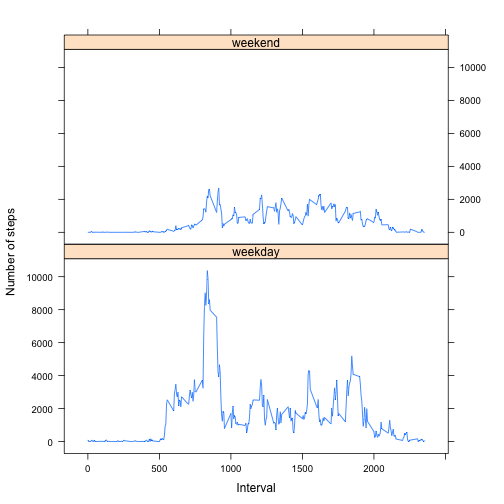

title: "Reproducible Research: Peer Assessment 1"
output: 
  html_document:
    keep_md: true

## Loading and preprocessing the data

```r
activity<-read.csv("activity.csv",header=TRUE)
activity$date<-as.Date(activity$date)
activity$steps<-as.numeric(activity$steps)

summary(activity)
```

```
##      steps              date               interval      
##  Min.   :  0.000   Min.   :2012-10-01   Min.   :   0.00  
##  1st Qu.:  0.000   1st Qu.:2012-10-16   1st Qu.: 588.75  
##  Median :  0.000   Median :2012-10-31   Median :1177.50  
##  Mean   : 37.383   Mean   :2012-10-31   Mean   :1177.50  
##  3rd Qu.: 12.000   3rd Qu.:2012-11-15   3rd Qu.:1766.25  
##  Max.   :806.000   Max.   :2012-11-30   Max.   :2355.00  
##  NA's   :2304
```


## What is mean total number of steps taken per day?

```r
by.day<-aggregate(activity$steps~activity$date,data=activity,FUN=sum,nar.rm=F) #steps by day
hist(by.day[,2],xlab="Steps", main="Number of steps per day",col="aliceblue") #histogram
```



```r
mean(by.day[,2],na.rm=TRUE) #mean
```

```
## [1] 10766.189
```

```r
median(by.day[,2],na.rm=TRUE) #median
```

```
## [1] 10765
```

## What is the average daily activity pattern?

```r
by.interval<-aggregate(activity$steps~activity$interval,data=activity,FUN=mean,na.rm=T) #steps by interval
plot(by.interval,type="l",xlab="5-minute intervals", ylab="Steps", main="Average of steps by interval") #plot
```



###Which 5-minute interval, on average across all the days in the dataset, contains the maximum number of steps?:
The interval with the maximum number of steps is **835**.  
There were **206** steps taken in that interval.

## Imputing missing values
The number of missing values in the dataset is **2304**.

```r
# strategy: replacing NAs with means of the corresponding intervals
for(i in 1:nrow(activity)){
   if (is.na(activity$steps[i])){
       activity$steps[i]<-by.interval[which(by.interval[,1]==activity$interval[i]),2]
   }
}
full.activity<-activity #creating a new dataset

by.day.full<-aggregate(full.activity$steps~full.activity$date,data=full.activity,FUN=sum,nar.rm=F) #steps by day
hist(by.day.full[,2],xlab="Steps",main="Number of steps per day",col="aliceblue") #histogram
```



```r
mean(by.day.full[,2],na.rm=TRUE) #mean
```

```
## [1] 10766.189
```

```r
median(by.day.full[,2],na.rm=TRUE) #median
```

```
## [1] 10766.189
```

The mean and median of the number of steps in the filled-in data are almost identical to the original values.  
Imputing missing data with means changes the distribution by reinforcing the central values.

## Are there differences in activity patterns between weekdays and weekends?
### Create factor variable with two labels "weekday" and "weekend".

```r
weekend<-c("Saturday","Sunday")

full.activity$day<-NA
full.activity$day[weekdays(full.activity$date) %in% weekend]<-"weekend" #marking weekend days
full.activity$day[is.na(full.activity$day)]<-"weekday" #marking weekdays
full.activity$day<-as.factor(full.activity$day) #making 'day' a factor
```

### Time series plot  of the 5-minute intervals and the average number of steps taken, averaged across all weekday days or weekend days. 

```r
library(lattice)
plot.data<-setNames(aggregate(full.activity$steps~full.activity$interval+full.activity$day,data=full.activity,FUN=sum,nar.rm=F),c("interval","day","steps")) #steps by weekdays/weekend days
xyplot(steps~interval|day,
       data=plot.data,
       type="l",
       xlab="Interval",ylab="Number of steps",
       layout=c(1,2)) #time series plot
```


